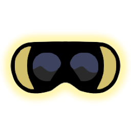
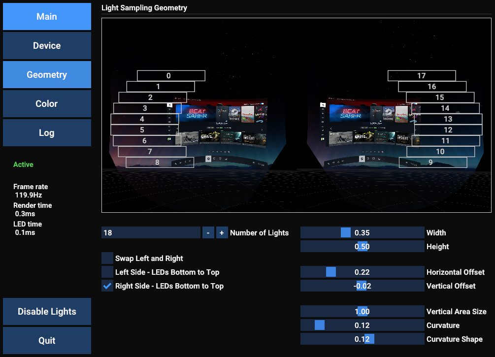
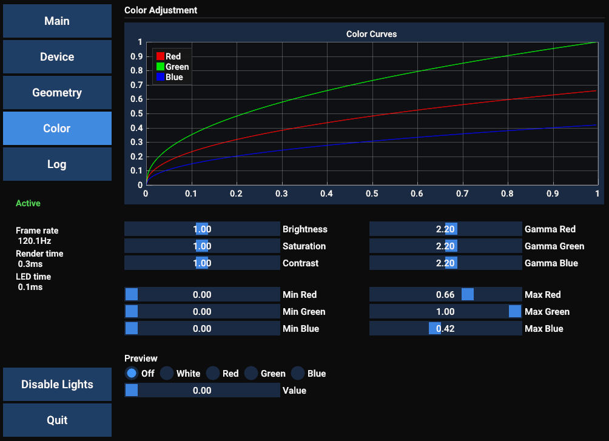

OpenVR Ambient Light
---

OpenVR Ambient Light is a control software for ambient LED lighting in virtual reality headsets. Unlike most other control software that sample the desktop, OpenVR Ambient Light directly samples the VR headset view. This provides accurate light estimation based on the content actually shown by the headset, and prevents other windows on the desktop from interfering.

The application uses the OpenVR API to sample the SteamVR compositor output using a compute shader, and uses this to drive LED arrays inside the headset periphery. Currently only LED setups using the serial [AdaLight](https://github.com/adafruit/Adalight) protocol are supported.

Any comments and suggestions are appreciated.

### Requirements ###

- Windows 10 or 11
- SteamVR compatible VR headset and computer
- Ambient lighting rig with AdaLight support. The application has been tested with this project for the Valve Index: https://github.com/Statonwest/VR_Ambilight

### Setup ###

1. Download and install the [Visual Studio C++ Redistributable (64 bit) ](https://aka.ms/vs/17/release/vc_redist.x64.exe)
2. Download the application release from the GitHub Releases page, and extract the files to the location you want to keep them in.
3. Start SteamVR.
4. Run openvr_ambient_light.exe. The settings menu will open up. To automatically start the application when SteamVR starts, check the appropriate option in the Main tab.
5. Make sure the ambient lighting rig is connected.
6. Navigate to the Device tab. Set the serial port to the one the lighting rig uses, and click Apply.

### Usage ###

When started by SteamVR, the application will be minimized to the desktop notification area (systray). Double click the icon to open the settings menu. Use the Enable/Disable Lights to toggle the lights. Closing the window will minimize it to the notification area. The Quit button will shut down the entire application.

The Geometry tab sets up what parts of the view will be sampled by each LED.

the Color tab allows adjusting the light output per channel.

### Building from source ###
The following are required:
- Visual Studio 2022 
- The MSVC build tools, and the Windows 10 SDK (installed via the Visual Studio Installer as "Desktop development with C++").
- All dependencies are set up as Git submodules.

### Possible improvements ###

- Support for more light protocols (please open an issue to request one).
- SteamVR overlays for the settings menu and geometry preview.